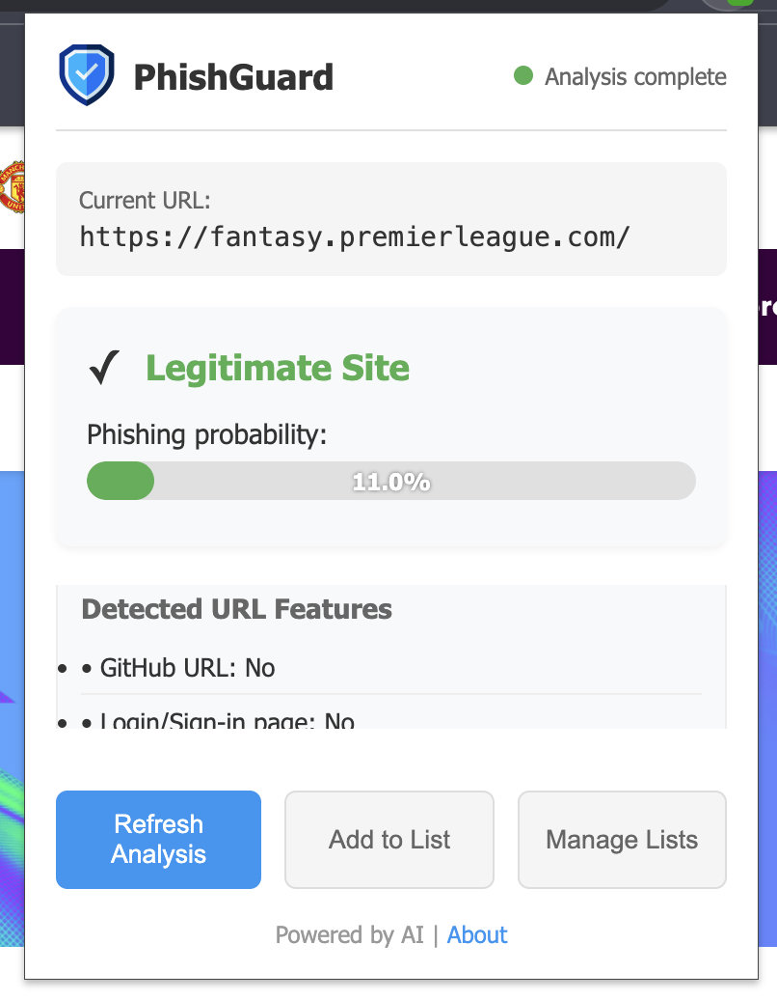
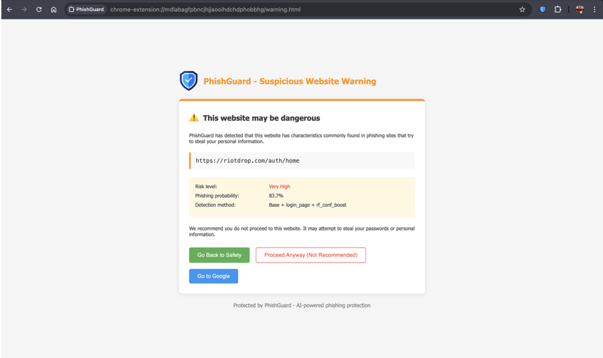
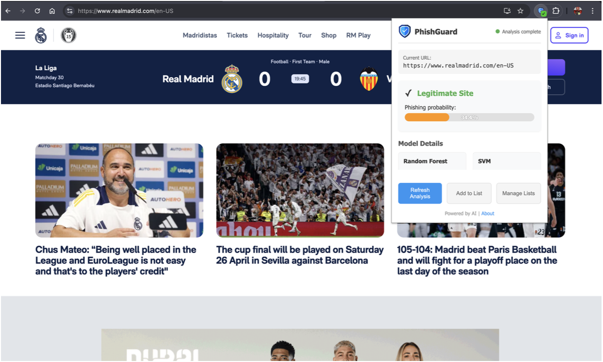
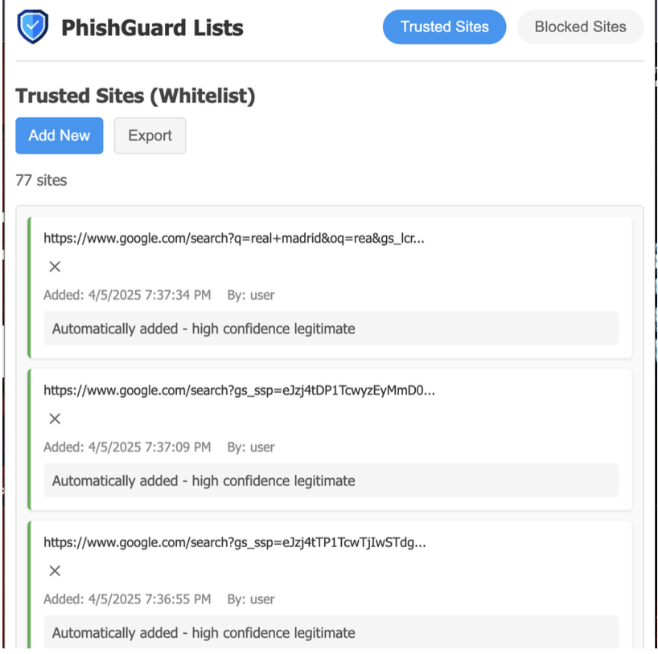
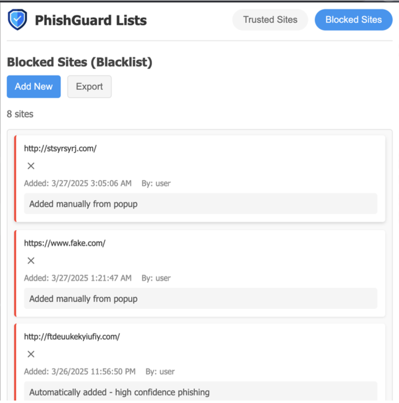

# PhishGuard

PhishGuard is a Phishing detection Chrome extension that detects phishing websites in real time by leveraging machine learning. Designed for seamless browsing security, PhishGuard analyzes URLs and alerts users to potential phishing threats before they can do harm.


## 🚀 Features

- **Real-Time Phishing Detection:** Instantly alerts users when they visit a suspicious or malicious website.
- **Machine Learning Powered:** Utilizes advanced machine learning models trained on large, diverse datasets for high accuracy.
- **URL Feature Analysis:** Examines numerous URL traits, including trusted domains, suspicious keywords, special characters, entropy, and more.
- **Customizable and Adaptive:** Continually improves by adapting to new phishing patterns.
- **Seamless Integration:** Lightweight extension that fits right into your Chrome browser.
- **Privacy-Focused:** Does not collect or transmit your personal browsing data.

## Screenshots








## 🛠️ Technology Stack

- **Frontend:** JavaScript, HTML, CSS (Chrome Extension APIs)
- **Backend:** Python (Flask API for ML inference)
- **Machine Learning:** Scikit-learn (SVM, Random Forest), pandas, tldextract
- **Inter-process Communication:** RESTful API (extension ↔ backend)
- **Others:** Joblib, Numpy, Scipy, etc.

## 📦 Folder Structure

```bash
phishing-detection/
├── backend/                # Python (Flask) backend for ML predictions
│   └── app.py
├── extension/              # Chrome Extension source code
│   ├── background.js
│   ├── popup.html
│   ├── popup.js
│   ├── manifest.json
├── train_SVM.py            # Model training script
├── train_random_forest.py  # Alternative model training
```

## 🖥️ Getting Started

### Prerequisites

- **Python 3.8+** (for backend server)
- **pip** (Python package installer)
- **Google Chrome** (latest version recommended)
- **Node.js** (optional, only if you want to use npm/yarn for frontend tooling)

### 1. Clone the Repository

```bash
git clone https://github.com/nikhilt77/PhishGuard.git
cd PhishGuard/phishing-detection
```

### 2. Install Python Dependencies

It's recommended to use a virtual environment:

```bash
python -m venv venv
source venv/bin/activate   # On Windows: venv\Scripts\activate
pip install -r requirements.txt
```

If `requirements.txt` does not exist, manually install:

```bash
pip install flask scikit-learn pandas tldextract numpy scipy joblib
```

### 3. Start the Backend Server

```bash
cd backend
python app.py
```

By default, the server will run at `http://localhost:5000`.

### 4. Load the Chrome Extension

1. Open Chrome and navigate to `chrome://extensions/`
2. Enable **Developer mode** (top right)
3. Click **Load unpacked**
4. Select the `extension` folder inside `phishing-detection`
5. The PhishGuard icon should now appear in your browser.

### 5. Using the Extension

- When you visit a website, the extension automatically analyzes the URL and interacts with the backend to determine if the site is suspicious.
- If a phishing threat is detected, you'll receive a browser notification or a warning popup.

> **Note:** Ensure the backend server is running before using the extension. The extension communicates with the backend at `http://localhost:5000/predict`.

## 🧪 Model Training (Advanced)

If you want to retrain the model:

1. Download or update phishing and legitimate URL datasets.
2. Run the training script:

```bash
python train_SVM.py
#or
python train_random_forest.py
```

3. The script will output model files which are loaded by the backend server (`app.py`).

## 🤝 Contributing

We welcome contributions! To get started:

1. Fork the repo and create your branch: `git checkout -b feature/your-feature`
2. Make your changes and commit: `git commit -m 'Add feature'`
3. Push to your branch: `git push origin feature/your-feature`
4. Open a pull request

## 📝 License

This project is licensed under the MIT License. See the [LICENSE](LICENSE) file for details.

---

**Stay safe and happy browsing with PhishGuard!**

```
